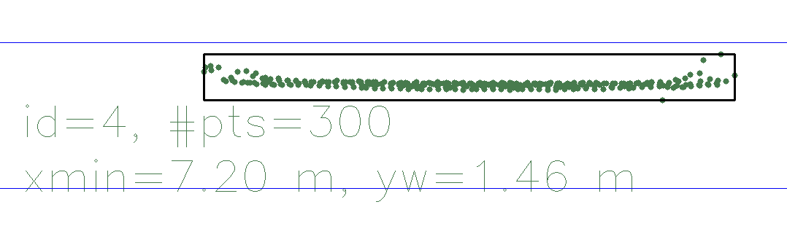
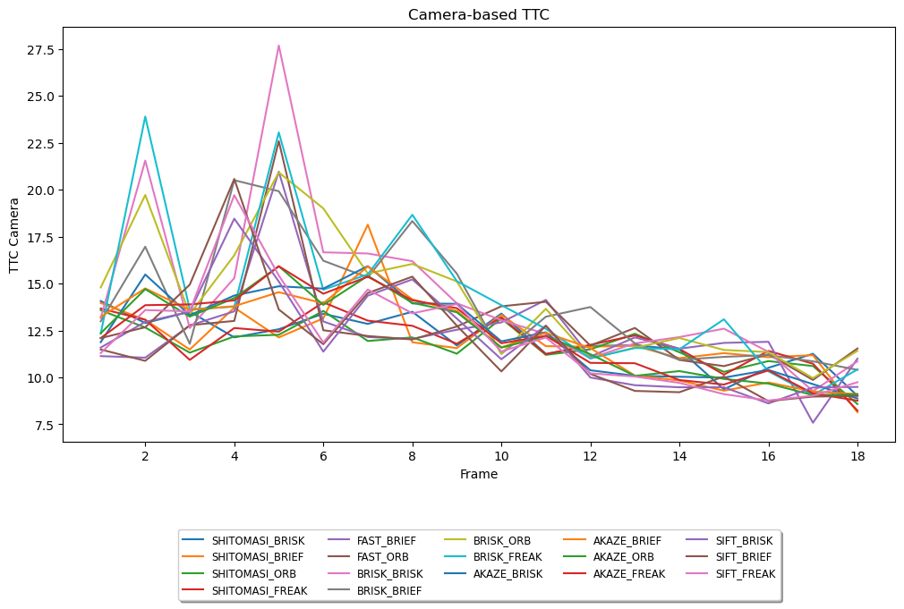

# Report

## FP.5 : Performance Evaluation 1

In my analyss, I observed certain inaccuracies in the Lidar-based Time-to-Collision (TTC) estimations. By manually estimating the distance to the preceding vehicle from the Lidar points, I found discrepancies between my estimates and the calculated Lidar TTC.

| Frame Number | xmin | TTC Lidar | TTC Lidar calc. |
|--------------|------|-----------|-----------------|
| 11           | 7.20 | 12.8086   | 3.7895          |

These discrepancies were mainly due to two factors:
* Outliers: Erroneous data points appeared to skew the calculated TTC. Effective outlier detection and removal methods would enhance the precision of our calculations.
* Noise: Fluctuations in the Lidar data were another issue, leading to variability in the TTC estimations. Implementing data smoothing or filtering could help alleviate this problem.

In conclusion, careful data processing is critical to increase the accuracy of Lidar-based TTC estimations. Strategies such as robust outlier handling and noise reduction techniques are key to refining our estimations.

## FP.6 : Performance Evaluation 2

In this task, I've created the script `build/metrics_runner.py` to execute all possible detector and descriptor combinations.
I've also made modifications to the `src/FinalProject_Camera.cpp` file to ensure that TTC values are returned only when CLI arguments are provided.
The processed results are stored in the `results/ttc_results.xlsx` file.
Within this file, detector-descriptor combinations are organized in ascending order based on their median values, facilitating effortless comparison.
Furthermore, individual graphs are plotted for each detector-descriptor combination to provide visual insight into the data:

