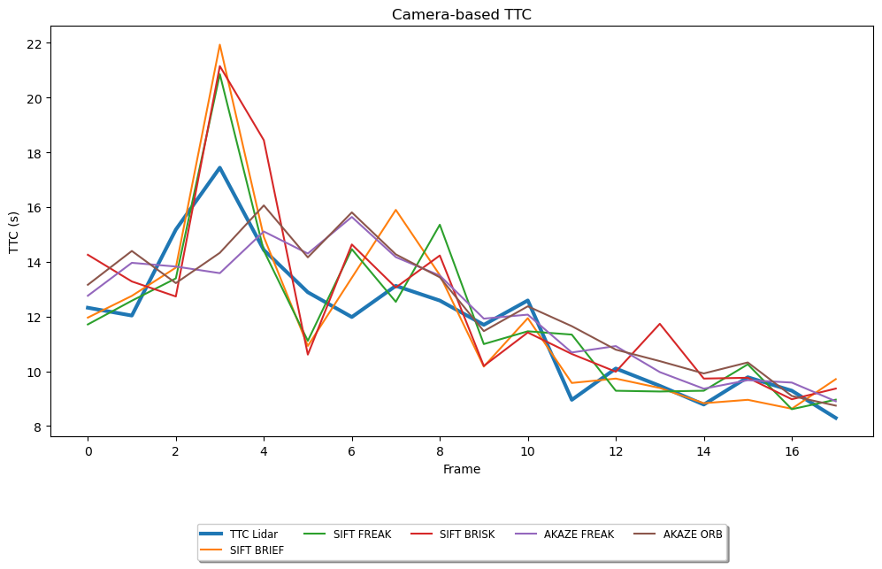

# Report

## FP.1 Match 3D Objects
Done in `src/camFusion_Student.cpp` at `matchBoundingBoxes`.

## FP.2 Compute Lidar-based TTC
Done in `src/camFusion_Student.cpp` at `computeTTCLidar`.

## FP.3 Associate Keypoint Correspondences with Bounding Boxes
Done in `src/camFusion_Student.cpp` at `clusterLidarWithROI`.

## FP.4 Compute Camera-based TTC
Done in `src/camFusion_Student.cpp` at `computeTTCCamera`.

## FP.5 : Performance Evaluation 1

In my analyss, I observed certain inaccuracies in the Lidar-based Time-to-Collision (TTC) estimations.
By manually estimating the distance to the preceding vehicle from the Lidar points, I found discrepancies between my estimates and the calculated Lidar TTC:

| Frame Number | xmin | TTC Lidar | TTC Lidar calc. |
|--------------|------|-----------|-----------------|
| 11           | 7.20 | 12.8086   | 3.7895          |

These discrepancies were mainly due to two factors:
* Outliers: Erroneous data points appeared to skew the calculated TTC. Effective outlier detection and removal methods would enhance the precision of our calculations.
* Noise: Fluctuations in the Lidar data were another issue, leading to variability in the TTC estimations. Implementing data smoothing or filtering could help alleviate this problem.

Careful data processing is critical to increase the accuracy of Lidar-based TTC estimations.
Strategies such as robust outlier handling and noise reduction techniques are key to refining our estimations.

To accomplish this, I've implemented a standard deviation filter in `src/camFusion_Student.cpp` at `computeTTCLidar` lines 18 to 42.

After implementing this filter, the TTC values are as following:

| Frame Number | xmin | TTC Lidar | TTC Lidar calc. |
|--------------|------|-----------|-----------------|
| 11           | 7.34 | 12.5881   | 14.6800         |

## FP.6 : Performance Evaluation 2

In this task, I've created the script `build/metrics_runner.py` to execute all possible detector and descriptor combinations.
I've also made modifications to the `src/FinalProject_Camera.cpp` file to ensure that TTC values are returned only when CLI arguments are provided.
The processed results are stored in the `results/ttc_results.xlsx` file.
In this file, combinations of detectors and descriptors are arranged in descending order according to their correlation with lidar TTC.

The top five combinations of detectors and descriptors are plotted to a graph for a visual understanding and comparability of the data:

